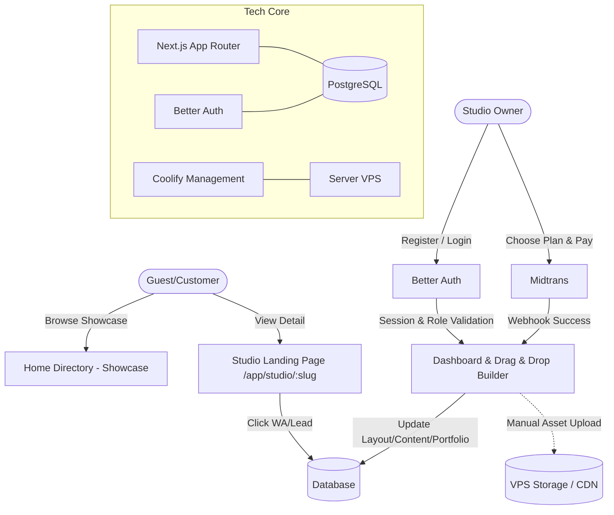

# PRD — Project Requirements Document

## 1. Executive Summary & Tujuan Bisnis
**Ruang Tato** adalah platform SaaS (Landing Page as a Service) yang dirancang khusus untuk pemilik studio tato di Indonesia. Model bisnis utama berfokus pada penyediaan solusi landing page instan, elegan, dan siap konversi melalui sistem membership berbayar. Studio tato dapat memiliki kehadiran digital profesional tanpa perlu keahlian coding atau biaya pengembangan website yang tinggi.

Tujuan MVP ini adalah membangun ekosistem di mana pemilik studio dapat membuat, mengelola, dan mempublikasikan landing page bertema studio tato dalam hitungan menit menggunakan antarmuka **drag and drop**. Platform ini dirancang untuk melayani audiens domestik dengan pendekatan yang sangat teknis dan praktis.

**Tujuan Strategis:**
*   **Akuisisi Pemilik Studio:** Menarik pemilik studio untuk berlangganan guna mendapatkan landing page profesional dengan domain kustom di Ruang Tato.
*   **Solusi Website Instan:** Menyediakan builder berbasis *drag and drop* yang dioptimalkan untuk portofolio tato, jadwal, dan konversi konsultasi.
*   **Monetisasi Membership:** Menghasilkan pendapatan melalui biaya berlangganan berkala (1, 3, 6, 12 bulan) dengan value proposition yang jelas.
*   **Showcase Direktori:** Beranda platform berfungsi sebagai galeri Showcase untuk memamerkan studio-studio yang telah bergabung, meningkatkan kepercayaan dan visibilitas kolektif.

## 2. Overview
Permasalahan utama pemilik studio tato adalah tingginya biaya, waktu teknis, dan kompleksitas pembuatan website portofolio yang elegan. Solusi website tradisional sering kali terlalu generik dan tidak mendukung struktur konversi yang optimal untuk industri tato.

Ruang Tato hadir sebagai solusi all-in-one yang mengubah paradigma pembuatan website menjadi serangkaian langkah visual sederhana. Bagi pemilik studio, platform ini adalah **Landing Page Builder** dengan struktur komponen yang sudah terbukti efektif untuk konversi tinggi. Pengguna hanya perlu menarik dan meletakkan (*drag and drop*) blok konten, mengunggah portofolio, menentukan URL kustom, dan halaman langsung aktif. Beranda situs berfungsi sebagai direktori showcase yang menunjukkan jaringan studio profesional. Tidak ada sinkronisasi otomatis pihak ketiga; seluruh pengaturan dilakukan secara manual dan intuitif melalui dashboard. Platform ini mengusung desain antarmuka yang bersih dan modern, dengan autentikasi dan manajemen akses yang dikendalikan secara ketat menggunakan Better Auth untuk keamanan operasional internal.

## 3. Requirements
*   **Desain Antarmuka Modern & Responsif:** Tampilan visual yang bersih, terstruktur, dan berorientasi pada konversi. Menggunakan komponen UI yang elegan dan konsisten, memaksimalkan keterbacaan dan pengalaman pengguna baik di mode edit maupun mode publik.
*   **Tanpa Registrasi Publik:** Platform ini eksklusif untuk operasional internal pemilik studio. Tidak ada fitur pendaftaran atau login untuk pengunjung awam.
*   **Struktur URL Eksklusif:** Setiap studio yang berlangganan memiliki URL unik: `ruangtato.com/app/studio/[username]`.
*   **Struktur Landing Page Terkomponen:** Halaman studio dibangun dari 11 blok tetap yang bisa diatur urutannya via drag & drop, mencakup Header, Hero, Goals, Overview, Features, How it Works, Creator Bio, Testimonials, FAQ, Final CTA, dan Footer.
*   **Landing Page Builder Mandiri (Drag & Drop):** Area khusus studio untuk menyusun tata letak secara visual, mengunggah portofolio secara manual, dan mengedit informasi profil tanpa bantuan teknis.
*   **Session-based access control:** Hanya pengguna dengan sesi valid dan role yang sesuai yang dapat mengedit, menerbitkan, atau mengelola konten studio.
*   **Owner Invitation & Self-Registration:** Pemilik studio dapat mendaftar mandiri atau diundang oleh admin, lalu dikaitkan dengan studio tertentu melalui sistem membership.
*   **Role-Based Permissions:** Mendukung minimal 3 role operasional: `owner`, `admin`, dan `member` untuk kontrol akses internal yang fleksibel.
*   **Sistem Berlangganan (Midtrans):** Akses ke builder dan publikasi halaman hanya diberikan kepada studio dengan status langganan aktif.
*   **Metrik Popularitas:** Sistem pelacakan otomatis untuk jumlah kunjungan (`view_count`) dan klik tombol kontak (`click_count`) sebagai parameter filter utama di direktori showcase.

## 4. Core Features
*   **Beranda Direktori Terpusat (Showcase):**
    *   **Listing Global:** Menampilkan semua studio tato aktif dari berbagai kota sebagai galeri showcase jaringan Ruang Tato.
    *   **Filter Cerdas:** Kemampuan menyaring berdasarkan kota dan mengurutkan berdasarkan "Paling Banyak Dilihat" atau "Paling Banyak Diklik" untuk menampilkan studio dengan performa terbaik.
*   **Halaman Eksklusif Studio (Landing Page):**
    *   Render cepat via Next.js SSR di path `/app/studio/[slug]`.
    *   Struktur halaman mengikuti 11 komponen standar yang dapat disusun ulang:
        1. Header/Nav
        2. Hero (headline + 3 benefits + CTA + portfolio card)
        3. Goals (outcome-focused + 3 features)
        4. Product Overview (long-form + mockup)
        5. Features Grid (6-9 items)
        6. How it Works (3-4 steps)
        7. Creator Bio (credentials + social proof)
        8. Testimonials (6-12 quotes)
        9. FAQ (8-12 Q&A)
        10. Final CTA (bold, centered)
        11. Footer
    *   Integrasi peta lokasi dengan styling yang responsif.
    *   Display informasi sterilisasi dan standar keamanan studio.
*   **Dashboard Studio & Drag & Drop Builder:**
    *   Akses login khusus pemilik studio melalui Better Auth.
    *   **Block-Based Drag & Drop Builder:** Antarmuka visual intuitif untuk menggeser, mengatur urutan, mengisi konten, dan mengatur aset visual untuk setiap dari 11 komponen struktur landing page tanpa coding.
    *   **Upload Portofolio Manual:** Fitur unggah foto/video secara langsung ke dalam komponen Hero atau Gallery untuk kontrol penuh atas tampilan visual.
    *   **Analytics Dashboard:** Melihat statistik kunjungan dan jumlah klik WhatsApp secara real-time untuk mengukur efektivitas landing page.
    *   **Billing & Settings:** Halaman manajemen langganan, invoice, dan pengaturan akun/role tim.
*   **Trusted Badge:** Indikator visual untuk studio yang sudah terverifikasi secara fisik/legal oleh tim Ruang Tato.
*   **Konversi Lead:**
    *   **Direct WhatsApp:** Tombol CTA yang langsung membuka chat dengan template pesan otomatis.
    *   **Lead Capture Form:** Formulir sederhana bagi pelanggan untuk meninggalkan pesan yang nantinya akan muncul di dashboard studio.

## 5. User Flow

**Perjalanan Pemilik Studio (Member):**
1.  **Akun & Registrasi:** Pemilik studio mendaftar mandiri atau menerima undangan admin melalui portal Ruang Tato, diverifikasi, dan mendapatkan akses login via Better Auth.
2.  **Aktivasi Membership:** Memilih paket berlangganan (1/3/6/12 bulan) dan menyelesaikan pembayaran otomatis melalui Midtrans.
3.  **Akses Dashboard Builder:** Setelah status aktif, pemilik studio langsung masuk ke Dashboard Builder.
4.  **Pembuatan Landing Page:** Menentukan `username/slug`, mengisi data profil dasar, mengunggah portofolio manual. Menggunakan antarmuka **Drag & Drop** untuk menyusun 11 blok komponen standar sesuai preferensi visual dan alur konversi yang diinginkan.
5.  **Publikasi:** Menekan tombol "Publish". Landing page langsung aktif instan, terindex, dan dapat diakses publik di `ruangtato.com/app/studio/[slug]`.
6.  **Monitoring & Optimasi:** Secara berkala memantau leads masuk, statistik performa (views & clicks), dan mengelola tim/internal atau memperpanjang membership melalui Billing & Settings.

## 6. Architecture



Sistem menggunakan Next.js App Router untuk manajemen routing yang efisien. Seluruh data konfigurasi landing page dan portofolio manual disimpan dalam format JSON di PostgreSQL, memungkinkan fleksibilitas tinggi bagi studio untuk mengubah tampilan tanpa mengubah struktur database. Deployment dikelola secara mandiri menggunakan Coolify di atas VPS untuk performa optimal dan kontrol penuh. Autentikasi, manajemen sesi, dan otorisasi peran sepenuhnya ditangani oleh Better Auth, memastikan lingkungan yang aman dan terisolasi untuk operasi internal studio.

## 7. Database Schema

1.  **Users & Authentication (Better Auth)**
    *   `users`: `id` (PK), `name`, `email` (Unique), `password_hash`, `created_at`, `updated_at`
    *   `sessions`: `id` (PK), `user_id` (FK), `token`, `expires_at`, `ip_address`, `user_agent`
    *   `accounts`: `id` (PK), `user_id` (FK), `provider`, `provider_account_id`, `access_token` (untuk OAuth)
    *   `verification_tokens`: `id` (PK), `identifier`, `token`, `expires_at`
2.  **Roles & Memberships**
    *   `roles`: `id` (PK), `name` (`owner`, `admin`, `member`), `permissions` (JSONB)
    *   `studio_memberships`: `id` (PK), `user_id` (FK), `studio_id` (FK), `role_id` (FK), `is_primary_owner` (Boolean)
3.  **Studios**
    *   `id` (PK), `slug` (Unique), `name`, `city`, `wa_number`
    *   `view_count` (Int), `click_count` (Int), `is_trusted` (Boolean)
    *   `page_config` (JSONB) - Menyimpan data terstruktur untuk 11 blok Komponen Landing Page (urutan, konten teks, aset gambar manual, pengaturan layout, dll)
4.  **Subscriptions**
    *   `id`, `studio_id` (FK), `plan_type`, `status` (active/expired), `expires_at`, `midtrans_order_id`
5.  **Leads**
    *   `id`, `studio_id` (FK), `name`, `email` (nullable), `message`, `status`, `created_at`

## 8. Tech Stack

*   **Framework:** **Next.js (App Router)**. Memberikan keunggulan SEO untuk direktori dan kecepatan rendering Server-Side untuk landing page studio.
*   **Design System:** **Tailwind CSS + shadcn/ui**. Konfigurasi tema visual yang bersih, modern, dan responsif. Fokus pada tipografi yang mudah dibaca, spasi yang proporsional, dan komponen UI yang konsisten untuk mendukung konversi tanpa batasan tema warna spesifik.
*   **Database:** **PostgreSQL**. Untuk skalabilitas data relasional dan penyimpanan JSONB yang efisien untuk konfigurasi halaman.
*   **Authentication:** **Better Auth**. Framework autentikasi modern yang dirancang khusus untuk Next.js. Menangani session management, OAuth, role-based access control, dan keamanan rute secara native. Ideal untuk melindungi dashboard premium, builder, dan halaman billing tanpa kompleksitas overhead.
*   **Infrastructure:** **Server VPS + Coolify**. Self-hosted environment untuk efisiensi biaya dan kontrol skalabilitas penuh.
*   **Payment:** **Midtrans**. Integrasi sistem pembayaran otomatis untuk aktivasi membership dan penanganan webhook status transaksi.
*   **Asset Management:** Penyimpanan gambar portofolio dan mockup ditangani secara manual melalui formulir unggah di dalam Builder, disimpan langsung di penyimpanan lokal VPS atau CDN pihak ketiga yang terintegrasi via URL statis.

## 9. Admin Panel (Super Admin)

Dashboard internal PT RUANG TATTO INDONESIA untuk memantau tenant, transaksi Midtrans, suspend/reactivate studio, analytics platform, dan audit log. Hanya user dengan `platform_role` internal yang boleh mengakses `/admin/*`.

### 9.1 Role & Access

| Role | Akses |
|------|-------|
| `super_admin` | Semua modul + settings (assign staff, trusted badge) + suspend/reactivate |
| `admin` | Tenants, payments, analytics, audit (read) |
| `support` | Tenants, payments (read) |
| `finance` | Payments, analytics |

Tenant biasa tanpa `platform_role` diarahkan ke `/unauthorized`.

### 9.2 Modul

- **Tenants** — daftar studio dengan filter, search, detail drawer, suspend/reactivate (super_admin).
- **Payments** — log transaksi Midtrans (`order_id`, `transaction_id`, `raw_payload`).
- **Analytics** — KPI platform dan grafik pertumbuhan bulanan.
- **Settings** — assign/revoke staff internal, toggle `is_trusted` studio.
- **Audit** — semua aksi admin (suspend, staff, trusted) dicatat di `audit_logs`.

### 9.3 Data Model (tambahan)

- `user.platform_role`, `user.status`
- `studios.status` (`active` / `suspended`)
- `payments`, `audit_logs`, `suspension_logs`

### 9.4 Operasional

```bash
PLATFORM_ADMIN_EMAIL=admin@ruangtato.com npm run admin:seed
npm run admin:backfill-payments   # histori invoice → payments
```

Webhook Midtrans adalah sumber kebenaran status pembayaran; redirect sukses bukan bukti final.