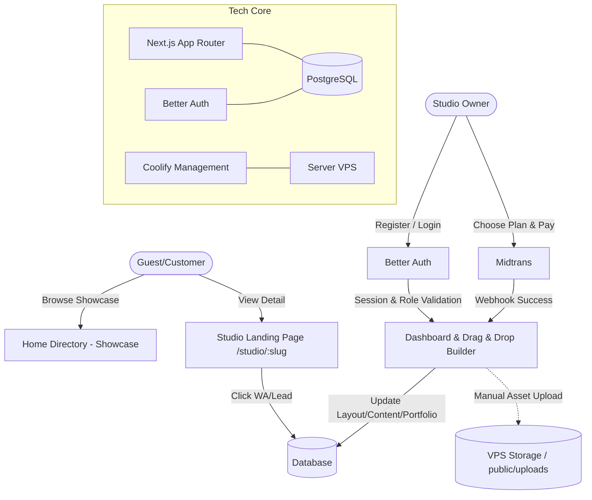

Berikut adalah draf **PRD Ruang Tato** yang telah dibenahi dan dioptimalkan secara struktural agar ramah terhadap alur kerja AI (*AI-Workflow Friendly*).

Format ini menerapkan prinsip **Konteks Terisolasi (Isolated Context)** dan **Spesifikasi Ketat (Strict Scaffolding)**. Seluruh terminologi telah diselaraskan (menggunakan `[slug]`), aset penyimpanan dikunci di lokal server untuk mencegah halusinasi AI, komponen `page_config` diberi contoh skema konkret, serta ditambahkan pembagian **Milestone Eksekusi** agar kamu bisa mengumpan PRD ini ke AI secara bertahap tanpa membakar token (*boncos*).

---

# PRD — Project Requirements Document: Ruang Tato

## 1. Executive Summary & Tujuan Bisnis

**Ruang Tato** adalah platform SaaS (Landing Page as a Service) yang dirancang khusus untuk pemilik studio tato di Indonesia. Model bisnis utama berfokus pada penyediaan solusi landing page instan, elegan, dan siap konversi melalui sistem membership berbayar. Studio tato dapat memiliki kehadiran digital profesional tanpa perlu keahlian coding atau biaya pengembangan website yang tinggi.

Tujuan MVP ini adalah membangun ekosistem di mana pemilik studio dapat membuat, mengelola, dan mempublikasikan landing page bertema studio tato dalam hitungan menit menggunakan antarmuka **drag and drop**. Platform ini dirancang untuk melayani audiens domestik dengan pendekatan yang sangat teknis dan praktis.

**Tujuan Strategis:**

* **Akuisisi Pemilik Studio:** Menarik pemilik studio untuk berlangganan guna mendapatkan landing page profesional dengan domain kustom di Ruang Tato.


* **Solusi Website Instan:** Menyediakan builder berbasis *drag and drop* yang dioptimalkan untuk portofolio tato, jadwal, dan konversi konsultasi.


* **Monetisasi Membership:** Menghasilkan pendapatan melalui biaya berlangganan berkala (1, 3, 6, 12 bulan) dengan value proposition yang jelas.


* **Showcase Direktori:** Beranda platform berfungsi sebagai galeri Showcase untuk memamerkan studio-studio yang telah bergabung, meningkatkan kepercayaan dan visibilitas kolektif.


---

## 2. Overview & Batasan Sistem (*System Boundaries*)

Permasalahan utama pemilik studio tato adalah tingginya biaya, waktu teknis, dan kompleksitas pembuatan website portofolio yang elegan. Solusi website tradisional sering kali terlalu generik dan tidak mendukung struktur konversi yang optimal untuk industri tato.

Ruang Tato hadir sebagai solusi all-in-one yang mengubah paradigma pembuatan website menjadi serangkaian langkah visual sederhana. Bagi pemilik studio, platform ini adalah **Landing Page Builder** dengan struktur komponen yang sudah terbukti efektif untuk konversi tinggi. Pengguna hanya perlu menarik dan meletakkan (*drag and drop*) blok konten, mengunggah portofolio, menentukan URL kustom, dan halaman langsung aktif. Beranda situs berfungsi sebagai direktori showcase yang menunjukkan jaringan studio profesional.

> 🚫 **BATASAN KETAT AI (ANTI-HALUSINASI):**
> * **TIDAK ADA REGISTRASI PUBLIK:** Platform ini eksklusif untuk operasional internal pemilik studio. Tidak ada fitur pendaftaran atau login untuk pengunjung awam.
> 
> 
> * **TIDAK ADA INTEGRASI PIHAK KETIGA OTOMATIS:** Seluruh sinkronisasi data, portofolio, dan pengaturan dilakukan secara manual dan intuitif melalui dashboard. Jangan membuat skrip integrasi otomatis ke platform eksternal seperti Instagram/TikTok API.
> 
> 
> * **MANAJEMEN ASET LOKAL:** Seluruh berkas gambar/media yang diunggah wajib disimpan di direktori lokal server (`public/uploads/`) melalui *file storage* VPS. Jangan gunakan AWS S3, Cloudinary, atau CDN eksternal lain kecuali diinstruksikan kemudian.
> 
> 
> 
> 

---

## 3. Requirements & Scope

* **Desain Antarmuka Modern & Responsif:** Tampilan visual yang bersih, terstruktur, dan berorientasi pada konversi menggunakan Tailwind CSS dan `shadcn/ui`.


* **Struktur URL Eksklusif:** Setiap studio yang berlangganan memiliki URL unik yang konsisten: `[ruangtato.com/studio/](https://ruangtato.com/studio/)[slug]`.


* **Struktur Landing Page Terkomponen:** Halaman studio dibangun dari 11 blok tetap yang bisa diatur urutannya via drag & drop.


* **Session-Based Access Control:** Hanya pengguna dengan sesi valid dan role yang sesuai lewat Better Auth yang dapat mengedit, menerbitkan, atau mengelola konten studio.


* **Owner Invitation & Self-Registration:** Pemilik studio dapat mendaftar mandiri atau diundang oleh admin, lalu dikaitkan dengan studio tertentu melalui sistem membership.


* **Role-Based Permissions:** Mendukung minimal 3 role operasional: `owner`, `admin`, dan `member`.


* **Sistem Berlangganan (Midtrans):** Akses ke builder dan publikasi halaman hanya diberikan kepada studio dengan status langganan aktif.


* **Metrik Popularitas:** Pelacakan otomatis berbasis database untuk jumlah kunjungan (`view_count`) dan klik tombol kontak (`click_count`).


---

## 4. Core Features & Component Blocks

### 4.1 Beranda Direktori Terpusat (Showcase)

* **Listing Global:** Menampilkan semua studio tato aktif dari berbagai kota sebagai galeri showcase jaringan Ruang Tato.


* **Filter Cerdas:** Menyaring berdasarkan kota dan mengurutkan berdasarkan "Paling Banyak Dilihat" (`view_count`) atau "Paling Banyak Diklik" (`click_count`).


### 4.2 Skema 11 Blok Komponen Landing Page Studio (`/studio/[slug]`)

Halaman di-render cepat via Next.js SSR dengan menyusun urutan komponen berdasarkan array data terstruktur:

1. **Header/Nav:** Logo studio, nama studio, dan navigasi internal.


2. **Hero:** Headline, 3 keunggulan utama (*benefits*), tombol CTA utama, dan kartu portofolio utama.


3. **Goals:** Tampilan berbasis hasil (*outcome-focused*) disertai dengan 3 fitur unggulan studio.


4. **Product Overview:** Deskripsi narasi panjang (*long-form text*) dikombinasikan dengan gambar mockup studio.


5. **Features Grid:** Kisi-kisi informasi berkapasitas 6-9 item layout.


6. **How it Works:** Panduan alur proses bertato di studio dalam 3-4 tahapan berurutan.


7. **Creator Bio:** Kredibilitas seniman tato (*tato artist credentials*) dan bukti sosial (*social proof*).


8. **Testimonials:** Komponen slider atau grid yang memuat 6-12 kutipan ulasan pelanggan.


9. **FAQ:** Struktur akordion yang memuat 8-12 daftar pertanyaan dan jawaban umum.


10. **Final CTA:** Komponen penutup berukuran besar, tebal, dan berada di posisi tengah (*centered layout*).


11. **Footer:** Hak cipta, tautan media sosial, informasi sterilisasi, dan standar keamanan studio.


### 4.3 Dashboard & Builder Studio

* **Better Auth Gateway:** Portal login khusus internal pemilik studio.


* **Block-Based Drag & Drop Builder:** Antarmuka visual intuitif untuk menggeser, mengatur urutan (order), dan mengisi konten dari 11 blok komponen di atas.


* **Upload Portofolio Manual:** Fitur unggah berkas langsung ke dalam form builder untuk dikirim ke sistem penyimpanan lokal server.


* **Analytics Dashboard:** Penampilan metrik `view_count` dan `click_count` (WhatsApp click) secara real-time.


* **Billing & Settings:** Halaman riwayat langganan, manajemen invoice Midtrans, dan delegasi peran anggota tim.


---

## 5. Architecture & Tech Stack

### 5.1 Tech Stack Blueprint

* **Framework:** Next.js (App Router).


* **Design System:** Tailwind CSS + `shadcn/ui`.


* **Database:** PostgreSQL.


* **Authentication:** Better Auth (Native session management & role-based routing).


* **Infrastructure:** Server VPS + Coolify (Self-hosted environment).


* **Payment Gateway:** Midtrans API (Webhook integration).


### 5.2 Flowchart Arsitektur



---

## 6. Database Schema & JSONB Specification

### 6.1 Tabel Relasional (PostgreSQL)

1. **Users & Sessions (Better Auth Native Schema)**

* `users`: `id` (PK), `name`, `email` (Unique), `password_hash`, `platform_role`, `status` (`active`/`suspended`), `created_at`.


* `sessions`: `id` (PK), `user_id` (FK), `token`, `expires_at`.


2. **Roles & Studio Memberships**

* `roles`: `id` (PK), `name` (`owner`, `admin`, `member`), `permissions` (JSONB).


* `studio_memberships`: `id` (PK), `user_id` (FK), `studio_id` (FK), `role_id` (FK).


3. **Studios**

* `id` (PK), `slug` (Unique), `name`, `city`, `wa_number`, `view_count` (Int), `click_count` (Int), `is_trusted` (Boolean), `status` (`active`/`suspended`), `page_config` (JSONB).


4. **Subscriptions**

* `id` (PK), `studio_id` (FK), `plan_type`, `status` (`active`/`expired`), `expires_at`, `midtrans_order_id`.


5. **Leads & Audits**

* `leads`: `id` (PK), `studio_id` (FK), `name`, `email`, `message`, `created_at`.


* `audit_logs`: `id` (PK), `admin_id` (FK), `action`, `target_id`, `details` (JSONB), `created_at`.


### 6.2 Spesifikasi Kolom `studios.page_config` (Struktur Skema Validasi AI)

AI wajib mengikuti struktur *array of objects* di bawah ini saat membuat fungsi penyimpanan builder:

```json
[
  {
    "block_id": "hero_section_01",
    "type": "hero",
    "order": 1,
    "content": {
      "headline": "Seni Tato Premium di Jantung Jakarta",
      "benefits": ["100% Jarum Steril", "Artis Bersertifikat", "Custom Design"],
      "cta_text": "Konsultasi Sekarang via WA",
      "portfolio_primary_image": "/uploads/hero_main.jpg"
    }
  },
  {
    "block_id": "faq_section_01",
    "type": "faq",
    "order": 2,
    "content": {
      "items": [
        { "question": "Apakah prosesnya sakit?", "answer": "Tingkat rasa sakit bervariasi..." }
      ]
    }
  }
]

```

---

## 7. Admin Panel (Super Admin Eksternal)

Dashboard manajemen internal pada rute `/admin/*` yang dilindungi oleh pengecekan parameter `user.platform_role`.

### 7.1 Matriks Otorisasi Akses

| Role | Modul Akses | Fitur Mutasi |
| --- | --- | --- |
| `super_admin` | Seluruh Modul Sistem

 | Suspend/Reactivate Studio, Assign Staff, Toggle Trusted Badge.

 |
| `admin` | Tenants, Payments, Analytics

 | Read-Only Access, Audit Log View.

 |
| `finance` | Payments, Analytics

 | Sinkronisasi Invoice, Verifikasi Webhook Midtrans.

 |

### 7.2 Aturan Operasional Webhook Pembayaran

* Fungsi otentikasi status pembayaran wajib mengandalkan verifikasi data **Webhook Midtrans** secara asinkronus ke server database.


* Aksi pengalihan halaman (*Client-side redirect*) setelah pembayaran sukses **tidak boleh** dijadikan parameter final untuk mengubah status keaktifan membership studio.


---

## 8. Rencana Implementasi Bertahap (*AI Execution Milestones*)

*Gunakan bab ini untuk memberikan perintah koding kepada AI per tahapan agar penggunaan token efisien.*

* **Milestone 1 (Infrastruktur & Auth):** Inisiasi skema database PostgreSQL menggunakan ORM pilihan, setup framework Better Auth, dan implementasi rute otentikasi internal untuk registrasi pemilik studio.


* **Milestone 2 (Skema Konten & Builder):** Pembuatan API router untuk penanganan mutasi data `page_config` JSONB, fungsi unggah berkas portofolio ke direktori `/public/uploads/`, dan implementasi drag-and-drop visual editor di dashboard studio.


* **Milestone 3 (Rendering & Showcase):** Implementasi SSR Next.js untuk halaman dinamis `/studio/[slug]`, pembuatan komponen visual untuk 11 blok, serta pengerjaan halaman direktori beranda dengan fungsi filter pencarian kota.


* **Milestone 4 (Billing & Admin Panel):** Integrasi sistem payment gateway Midtrans beserta penanganan fungsi keamanan rute halaman `/admin/*` untuk tata kelola admin.