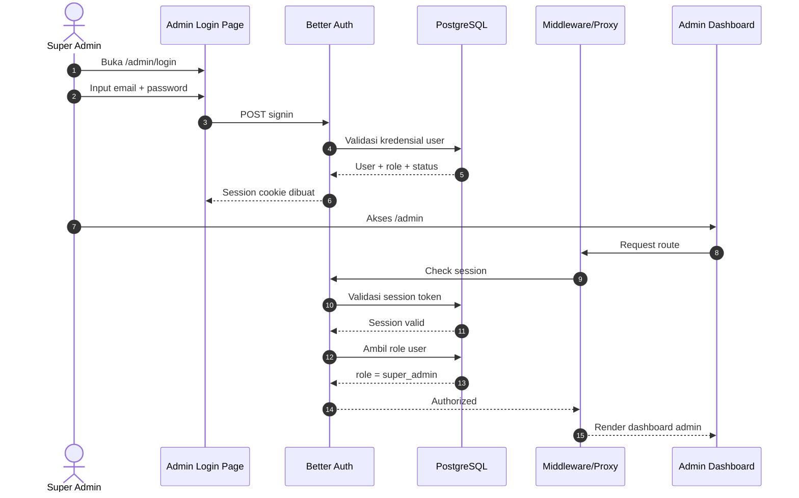
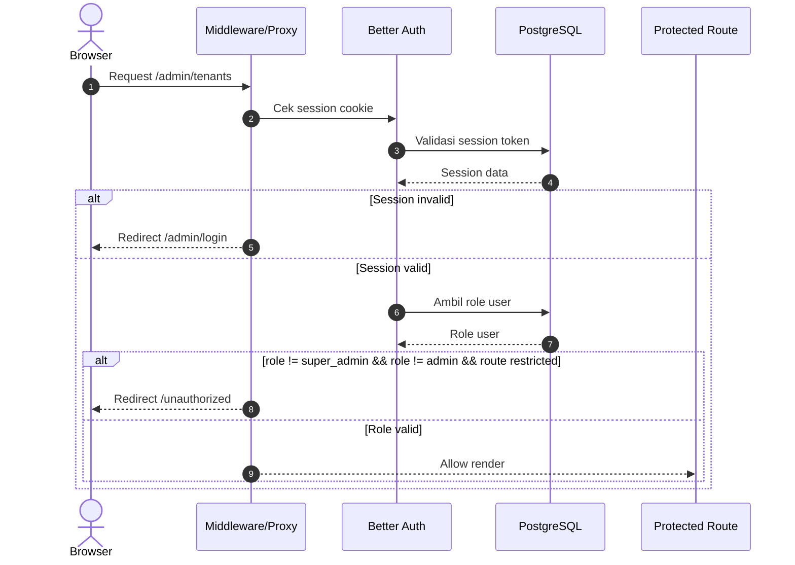
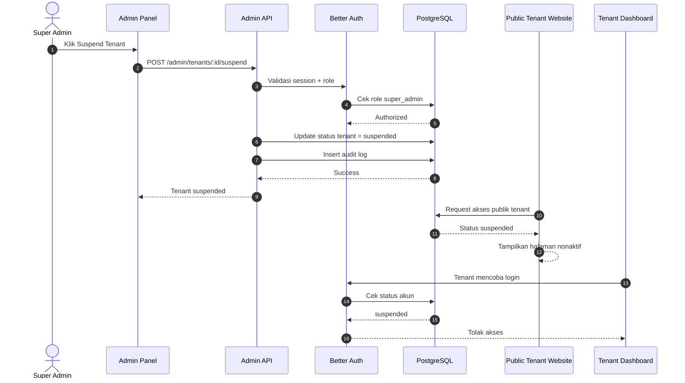
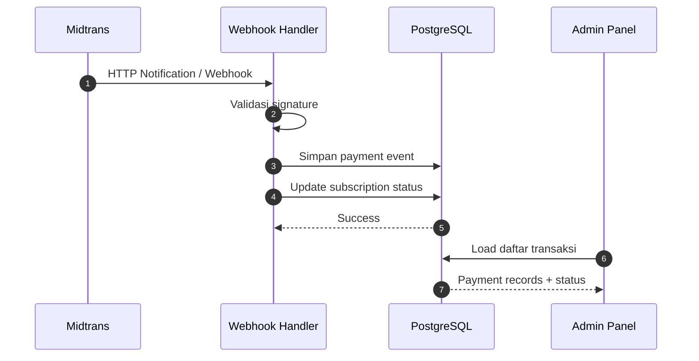

# Ya, buatkan semuanya untuk dimasukkan ke bagian Admin Panel PRD

Tentu. Di bawah ini saya susun **seluruh materi siap tempel** ke bagian **Admin Panel PRD**: alur sistem, sequence diagram, requirement detail, role/access control, data model teknis, dan acceptance criteria. Saya buat dengan orientasi implementasi **Better Auth + Next.js App Router + PostgreSQL + Midtrans**, serta proteksi route yang aman.[^1][^2][^3]

***

# 9. Admin Panel (Super Admin RUANG TATTO)

## 9.1 Tujuan

Admin Panel adalah dashboard internal milik PT RUANG TATTO INDONESIA untuk mengelola seluruh tenant, memantau transaksi, melakukan suspend/reactivate akun, dan melihat analytics basic platform. Panel ini hanya boleh diakses oleh role internal yang diizinkan, terutama `super_admin`, dan tidak boleh dapat diakses oleh tenant biasa.[^2][^1]

## 9.2 Ruang Lingkup

Fitur Admin Panel mencakup:

- Monitoring user/tenant.
- Monitoring pembayaran Midtrans.
- Suspend dan reaktivasi tenant.
- Analytics basic platform.
- Audit log untuk seluruh aksi admin.
- Proteksi route berbasis role.[^4][^3][^2]

## 9.3 Role and Access Model

Role yang disarankan:

- `super_admin`.
- `admin`.
- `support`.
- `finance`.

Aturan akses:

- `super_admin` memiliki akses penuh ke seluruh modul.
- `admin` dapat melihat tenant, pembayaran, dan analytics.
- `support` dapat melihat tenant dan pembayaran, tetapi tidak boleh suspend jika dibatasi.
- `finance` fokus pada transaksi dan pendapatan.
- Tenant biasa tidak punya akses ke route admin sama sekali.[^1][^2]

***

# 9.4 Alur Sistem Admin Panel

## Alur Sistem Tingkat Tinggi

1. Super admin membuka halaman login admin.
2. Super admin login menggunakan Better Auth.
3. Better Auth membuat session cookie.
4. Request ke `/admin/*` melewati middleware/proxy.
5. Middleware memeriksa session dan route yang dituju.
6. Server memvalidasi session ke database.
7. Server memeriksa role user.
8. Jika role cocok, route admin dirender.
9. Jika tidak, user diarahkan ke `/admin/login` atau `/unauthorized`.
10. Setiap aksi admin dicatat ke `audit_logs`.
11. Perubahan status tenant memengaruhi akses publik dan akses dashboard tenant.[^3][^2][^1]

***

# 9.5 Sequence Diagram

## 9.5.1 Login dan Akses Admin

## 9.5.2 Proteksi Route Admin

## 9.5.3 Suspend Tenant

## 9.5.4 Monitoring Pembayaran

Midtrans webhook harus diperlakukan sebagai sumber kebenaran utama untuk status pembayaran, bukan redirect halaman sukses.[^4][^3]

***

# 9.6 Functional Requirements Table

| ID | Modul | Requirement | Priority | Kriteria Penerimaan |
| :-- | :-- | :-- | --: | :-- |
| ADM-01 | Auth | Super admin dapat login via Better Auth. | P0 | Session valid terbentuk. |
| ADM-02 | Auth | Route `/admin/*` harus diproteksi. | P0 | Non-admin tidak bisa akses. |
| ADM-03 | Role | Sistem mendukung role `super_admin`, `admin`, `support`, `finance`. | P0 | Role dibaca dari DB. |
| ADM-04 | Tenant Monitoring | Tampilkan daftar seluruh tenant. | P0 | Data bisa dipaginate dan difilter. |
| ADM-05 | Tenant Monitoring | Tampilkan studio, owner, email, WA, paket, status, reg date, expiry date. | P0 | Semua field tampil di tabel detail. |
| ADM-06 | Payment Monitoring | Tampilkan transaksi Midtrans. | P0 | Status pending/success/failed/expired muncul. |
| ADM-07 | Payment Monitoring | Detail transaksi menyimpan `order_id`, `transaction_id`, `raw_payload`. | P0 | Detail bisa dibuka admin. |
| ADM-08 | Suspend | Admin dapat suspend tenant. | P0 | Status berubah dan akses tenant diblok. |
| ADM-09 | Suspend | Admin dapat reactivate tenant. | P0 | Akses tenant kembali aktif. |
| ADM-10 | Analytics | Tampilkan KPI dasar platform. | P1 | Total user, subscriber, transaksi, revenue. |
| ADM-11 | Analytics | Tampilkan grafik pertumbuhan bulanan. | P1 | Chart user, transaksi, subscriber. |
| ADM-12 | Audit | Semua aksi admin dicatat di audit log. | P0 | Ada actor, action, target, reason. |

***

# 9.7 Monitoring User

## Deskripsi

Admin harus dapat melihat seluruh tenant yang terdaftar di platform. Data yang perlu ditampilkan meliputi nama studio, owner, email, WhatsApp, paket berlangganan, status akun, tanggal registrasi, dan tanggal berakhir langganan.[^5]

## Requirements Detail

- Tabel tenant mendukung pagination.
- Search berdasarkan nama studio, nama owner, email, dan nomor WhatsApp.
- Filter berdasarkan status akun, status subscription, paket, kota, dan tanggal registrasi.
- Sort berdasarkan terbaru, terlama, masa aktif berakhir, dan status aktif.
- Admin dapat membuka tenant detail drawer atau detail page.
- Admin dapat melihat relasi studio, subscription, dan payment terakhir.

## Data source

- `users`
- `studios`
- `subscriptions`
- `payments`

***

# 9.8 Monitoring Pembayaran

## Deskripsi

Admin harus dapat memantau seluruh transaksi yang terjadi melalui Midtrans. Modul ini membantu support, finance, dan verifikasi pembayaran.[^3][^4]

## Requirements Detail

- Tabel transaksi mendukung filter status pembayaran.
- Status yang wajib tersedia: pending, success, failed, expired.
- Admin dapat melihat nomor transaksi, nominal, paket, studio, tanggal transaksi, dan metode pembayaran.
- Admin dapat membuka detail payload pembayaran untuk debugging atau audit.
- Data transaksi harus sinkron dengan webhook Midtrans dan status settlement yang masuk dari backend.[^6][^3]

## Data source

- `payments`
- `subscriptions`
- `studios`

***

# 9.9 Suspend / Nonaktifkan Akun

## Deskripsi

Super admin dapat menonaktifkan tenant yang melanggar kebijakan, habis masa aktif, atau perlu dibatasi secara operasional. Suspend harus memblokir akses publik dan login tenant, tetapi data tetap aman tersimpan.[^5]

## Aturan Sistem

- Status tenant berubah menjadi `suspended`.
- Website publik tenant tidak dapat diakses.
- Tenant tidak dapat login ke dashboard.
- Subscription dapat tetap disimpan sebagai history.
- Admin wajib memberikan alasan suspend.
- Setiap suspend/reactivate harus dicatat di audit log.

## Dampak Suspend

- Proteksi route publik tenant menolak render.
- Dashboard tenant menolak session login.
- Tenant diarahkan ke halaman informasi status akun.

***

# 9.10 Analytics Basic

## Deskripsi

Analytics basic harus menampilkan ringkasan kesehatan platform untuk internal admin. Fokusnya adalah angka inti dan tren sederhana, bukan analitik kompleks.[^5]

## KPI Utama

- Total user terdaftar.
- Total user aktif.
- Pengguna baru bulan ini.
- Total subscriber aktif.
- Total transaksi.
- Total revenue.
- Revenue bulan berjalan.
- Website studio aktif.
- Website studio nonaktif.
- Jumlah portfolio yang diunggah.

## Grafik

- Pertumbuhan pengguna per bulan.
- Pertumbuhan transaksi per bulan.
- Pertumbuhan subscriber per bulan.

## Visual Style

- KPI cards ringkas.
- Line chart sederhana.
- Bar chart opsional.
- Angka besar, tooltip minimal, warna aksen terbatas.

***

# 9.11 Admin Panel UI Structure

## Navigasi

- Overview.
- Tenants.
- Payments.
- Suspensions.
- Analytics.
- Audit Log.
- Settings.

## Prinsip UI

- Compact.
- Clear hierarchy.
- Table-heavy layout.
- Filter bar selalu mudah dijangkau.
- Drawer detail untuk inspeksi cepat.
- Badge status dengan warna lembut.
- Action button untuk suspend/reactivate harus konfirmasi dua langkah.

***

# 9.12 Technical Architecture

## Access Control Layer

- Better Auth digunakan sebagai sumber identitas dan session.
- Middleware/proxy memeriksa route `/admin/*`.
- Server-side check memvalidasi session dan role sebelum render.
- API admin harus memvalidasi role sebelum eksekusi action.[^2][^1]

## Suggested Route Protection Flow

- `/admin/login` → public.
- `/admin/*` → protected.
- `/admin/api/*` → protected.
- `/admin/analytics` → role-based.
- `/admin/payments` → role-based.
- `/admin/suspensions` → super_admin only.

## Implementation Notes

- Jangan hanya mengandalkan client-side hiding.
- Session check harus dilakukan di server.
- Role check harus berbasis database.
- Semua state-sensitive action harus masuk audit log.[^1][^2]

***

# 9.13 Technical Database Schema

## `users`

Tambahkan atau pastikan field:

- `id`
- `name`
- `email`
- `email_verified_at`
- `password_hash`
- `role`
- `status`
- `created_at`
- `updated_at`

## `studios`

Field tambahan:

- `id`
- `owner_id`
- `slug`
- `name`
- `city`
- `wa_number`
- `status`
- `is_trusted`
- `page_config`
- `created_at`
- `updated_at`

## `subscriptions`

Field:

- `id`
- `studio_id`
- `plan_id`
- `status`
- `starts_at`
- `expires_at`
- `midtrans_order_id`
- `midtrans_transaction_id`
- `created_at`
- `updated_at`

## `payments`

Field:

- `id`
- `subscription_id`
- `order_id`
- `transaction_id`
- `amount`
- `payment_method`
- `transaction_status`
- `fraud_status`
- `raw_payload`
- `paid_at`
- `created_at`

## `audit_logs`

Field:

- `id`
- `actor_user_id`
- `action`
- `target_type`
- `target_id`
- `reason`
- `metadata`
- `created_at`

## `suspension_logs`

Field:

- `id`
- `actor_user_id`
- `studio_id`
- `status_before`
- `status_after`
- `reason`
- `created_at`

## `platform_metrics_cache`

Field:

- `id`
- `metric_key`
- `metric_value`
- `period_start`
- `period_end`
- `cached_at`

***

# 9.14 Acceptance Criteria

Modul Admin Panel dinyatakan selesai jika:

- Super admin bisa login dan masuk panel admin.
- Route admin tertolak untuk user non-admin.
- Tenant list tampil lengkap dan dapat difilter.
- Payment list sinkron dengan Midtrans.
- Suspend/reactivate mengubah akses tenant secara real-time atau near real-time.
- Analytics basic menampilkan KPI utama dan grafik sederhana.
- Semua aksi admin tercatat di audit log.[^3][^5][^1]

***

# 9.15 PRD Insert Ready

Kalau Anda ingin menempelkan ke PRD final, Anda bisa pakai ringkasan ini sebagai pembuka bab:

**Admin Panel (Super Admin RUANG TATTO) adalah dashboard internal untuk PT RUANG TATTO INDONESIA yang digunakan untuk mengelola tenant, memantau pembayaran Midtrans, menangguhkan atau mengaktifkan akun, serta melihat analytics basic platform. Panel ini diproteksi menggunakan Better Auth dan role-based access control pada route `/admin/*`. Semua aksi sensitif wajib tercatat di audit log.**[^2][^1][^3]

Saya juga bisa lanjut buatkan **versi tabel PRD yang lebih formal dan rapi per modul**, atau **diagram arsitektur admin panel dalam format mermaid khusus**.
[^10][^11][^12][^7][^8][^9]

⁂

[^1]: https://better-auth.com/docs/integrations/next

[^2]: https://medium.com/@turingvang/nextjs-middleware-protected-routes-bcb3df06db0c

[^3]: https://docs.midtrans.com/docs/handle-after-payment

[^4]: https://docs.midtrans.com/docs/midtrans-notification-features

[^5]: prd.md

[^6]: https://docs.midtrans.com/docs/https-notification-webhooks

[^7]: https://www.better-auth.com/docs/examples/next-js

[^8]: https://www.youtube.com/watch?v=D2f_gN1uZbc

[^9]: https://www.prisma.io/docs/guides/authentication/better-auth/nextjs

[^10]: https://medium.com/@parthparmar4507/setup-better-auth-with-nextjs-in-minutes-ecf0e4327722

[^11]: https://www.better-auth.com/docs/guides/next-auth-migration-guide

[^12]: https://github.com/vercel/next.js/discussions/82645

